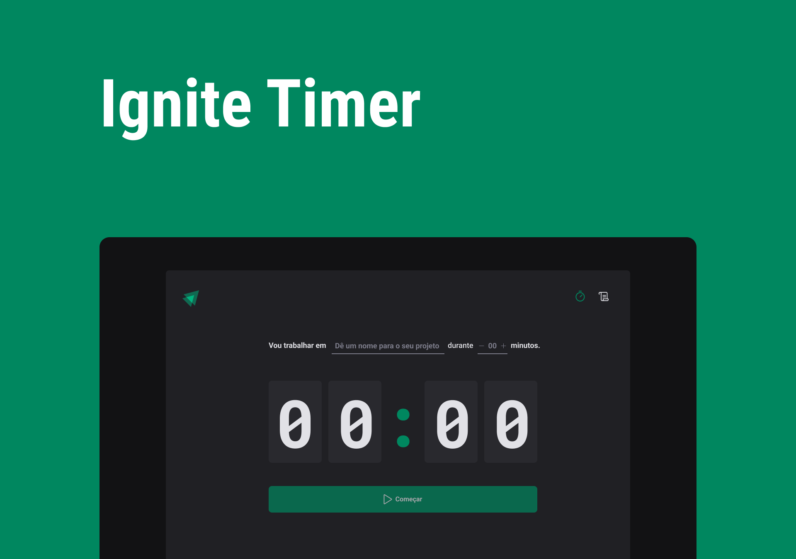

<h1 align="center">
  
</h1>

<h1 align="center">
  
</h1>

# Sobre o projeto

<p>
  Ignite Timer é um aplicativo web para executar tarefas temporizadas, você escolhe o nome da tarefa e o tempo que pretende terminá-la. Todos os processos ficam salvos no seu localstorage e são listados na aba de histórico.
</p>

# Tecnologias

- [Vite](https://vitejs.dev/)
- [ReactJs](https://reactjs.org/)
- [TypeScript](https://www.typescriptlang.org/)
- [Phosphor React](https://github.com/phosphor-icons/phosphor-react)
- [Zod](https://zod.dev/)
- [React Hook Form](https://react-hook-form.com/)
- [ImmerJs](https://github.com/immerjs/immer)
- [Styled-components](https://styled-components.com/)
- [Date-fns](https://date-fns.org/)

## Como baixar o projeto

```bash
# Clonar o repositório
$ git clone https://github.com/wellingtonrodriguesbr/ignite-timer.git

# Entrar no diretório
$ cd ignite-timer


# Instalar as dependências
$ npm install

# Rodar o projeto
$ npm run dev
```

<br/>
<hr/>

<p align="center">Desenvolvido por <a href="https://www.linkedin.com/in/wellingtonrodriguesbr/" target="_blank">Wellington Rodrigues</a> ✌🏽</p>
